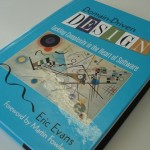

{:align="left"}

Comecei a ouvir falar de Domain Driven Design (ou DDD para os íntimos) na  época em que entrei no grupo de discuções do DotNet Architects, percebi que tinha muita gente da comunidade falando a respeito e resolvi entender um pouco mais sobre esse tipo de arquitetura.

O DDD  é um modelo de arquitetura proposto pelo Eric Evans apoiado por grandes gurus da informática, reúne muitos aspectos já existentes formando um padrão que é considerado por muitos como “o retorno da orientação a objeto”.

O foco do DDD é no Domínio (domínio é todo o universo que envolve o seu problema), através da utilização de uma Linguagem Ubliqua e um Modelo Rico, ele tenta prover uma arquitetura clara que revele com facilidade as características e funções de cada elemento do seu sistema assim como a interação entre eles.

Linguagem Ubliqua (ou linguagem onipresente) trata-se da padronização os termos usados na análise e no desenvolvimento, linguagem comum utilizando os mesmos termos do negocio no desenvolvimento evitando modificação dos mesmos ou abuso de termos técnicos não correspondentes ao negocio .

Modelo Rico basicamente seria o uso de objetos com propriedades e  métodos, diferente do modelo anêmico onde os objetos possuem somente propriedades, e os métodos com a regra de negocio concentram-se em classes diferente.

Para criar um bom software você tem que conhecer bem o cenário, refletir o mundo real em código não é algo fácil, e a utilização de uma linguagem Ubliqua  ajuda bastante na hora de construir essa ponte entre o mundo real e as classes. Todos os envolvidos devem estar falando a mesma língua, nada de “tecnês” que não faça parte do domínio.

DDD é ideal principalmente para domínios com regras de negócio complexas pois esse foco em separação de papeis, coesão e simplicidade ajuda e muito na hora de entender cada ponto do sistema para desenvolver e dar manutenção.

Este padrão arquitetural é constituído por alguns elementos, não é necessário utilizar todos, tudo depende do seu cenário; Alguns de seus elementos são: Serviços, Repositórios, Entidades, Objetos de Valor, Agregados, Factories, Modelo Rico,…

Brevemente vou descrever mais detalhadamente cada um de seus elementos.

Por mais que eu goste de DDD e acredite que é uma arquitetura muito poderosa não podemos dizer que ela veio para substituir as outras,  um arquiteto de verdade deve saber observar o problema antes de tudo e decidir a melhor arquitetura que se encaixa ao cenário.

Gosto de trabalhar voltado a DDD de uma forma mais evolutiva, sem me prender logo de cara a todas suas recomendações, vou aplicando cada elemento conforme vai surgindo a necessidade.

E para quem quer se aprofundar no assunto recomendo a leitura do [livro do Evans](https://www.amazon.com/Domain-Driven-Design-Tackling-Complexity-Software/dp/0321125215), também tem um e-book gratuito sobre o assunto no [infoQ](https://www.infoq.com/minibooks/domain-driven-design-quickly/) alem da [palestra do Giovanni Bassi sobre DDD](http://www.dotnetarchitects.net/post/Resultado-da-terceira-reuniao-DDD.aspx) que dá uma boa ideia geral sobre o assunto.

Estrutura do DDD:

Até a próxima.
